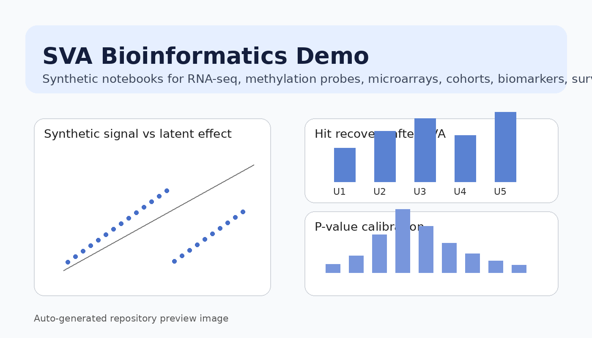
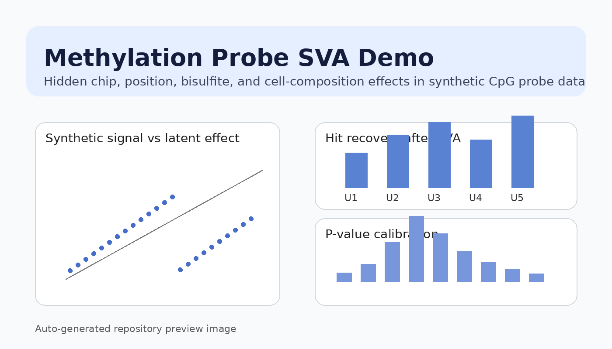

# SVA Bioinformatics Demo




A long-form, portfolio-style teaching repository that demonstrates how **Surrogate Variable Analysis (SVA)** can be used to recover biological signal from synthetic omics datasets contaminated by hidden technical and biological confounding.

This repository is intentionally designed to look substantial, readable, and modular on GitHub. It is split into multiple notebooks so each use case can stand alone, while still sharing a common conceptual framework and helper code. The emphasis is on **bioinformatics realism**, **teaching clarity**, and **practical modeling intuition**.

---

## Table of Contents

- [Overview](#overview)
- [Why SVA matters in bioinformatics](#why-sva-matters-in-bioinformatics)
- [What this repository contains](#what-this-repository-contains)
- [Repository layout](#repository-layout)
- [Notebook guide](#notebook-guide)
- [Core use cases](#core-use-cases)
- [Spotlight: methylation probe analysis](#spotlight-methylation-probe-analysis)
- [Modeling concepts demonstrated](#modeling-concepts-demonstrated)
- [How the synthetic data are constructed](#how-the-synthetic-data-are-constructed)
- [Why this project is useful](#why-this-project-is-useful)
- [Quick start](#quick-start)
- [Environment setup](#environment-setup)
- [Expected learning outcomes](#expected-learning-outcomes)
- [Who this repo is for](#who-this-repo-is-for)
- [Project philosophy](#project-philosophy)
- [Potential extensions](#potential-extensions)
- [Limitations](#limitations)
- [License](#license)

---

## Overview

Surrogate Variable Analysis is one of the most useful conceptual tools in modern omics analysis whenever the measured signal is entangled with latent structure. In real studies, the strongest source of variance is often not the biological variable of interest. Instead, it may be caused by hidden factors such as:

- batch or processing date
- operator-specific effects
- chip or slide position
- scanner drift
- reagent lot variability
- bisulfite conversion quality
- hidden cell composition
- RNA quality differences
- sample storage duration
- cohort-specific measurement conditions
- ancestry or population structure
- sample handling artifacts

This repository builds a series of synthetic examples around exactly those problems. Each notebook shows how a signal can appear distorted without latent adjustment, and how SVA-like surrogate variables can help recover more interpretable structure.

---

## Why SVA matters in bioinformatics

In many analyses, the variable you care about explains only a modest portion of total variation. That means naïve differential expression or association testing can produce:

- inflated false positives
- unstable rankings of top features
- misleading p-value histograms
- apparent cohort separation driven by technical effects
- biomarker lists contaminated by hidden nuisance structure
- poor reproducibility across studies

SVA addresses this by estimating latent factors directly from the data and incorporating them into downstream models. This does **not** replace good study design, normalization, or quality control. Instead, it provides a flexible way to model residual unwanted structure that was not explicitly measured.

This repo is meant to make that idea tangible.

---

## What this repository contains

This project includes:

- a full monolithic notebook for users who want everything in one place
- a split notebook structure for modular browsing
- synthetic but biologically plausible datasets
- heavily commented R code
- multiple analysis styles covering common omics scenarios
- a dedicated methylation probe example
- summary notebooks that compare naive models versus SVA-adjusted models
- a conda environment file for reproducibility
- preview assets to improve GitHub presentation

The code is intentionally verbose so it can function as:

- a lecture demo
- a study aid
- a portfolio project
- a template for mock interview discussions
- a starting point for customizing your own teaching materials

---

## Repository layout

```text
.
├── assets/
│   ├── methylation_preview.png
│   └── repo_preview.png
├── notebooks/
│   ├── 00_overview_and_helpers.ipynb
│   ├── 01_rnaseq_sva_demo.ipynb
│   ├── 02_microarray_sva_demo.ipynb
│   ├── 03_methylation_probe_sva_demo.ipynb
│   ├── 04_multicohort_sva_demo.ipynb
│   ├── 05_biomarker_discovery_sva_demo.ipynb
│   ├── 06_survival_signature_sva_demo.ipynb
│   ├── 07_eqtl_like_sva_demo.ipynb
│   ├── 08_pathway_interpretation_sva_demo.ipynb
│   └── 09_summary_across_use_cases.ipynb
├── environment.yml
├── LICENSE
├── README.md
├── requirements.txt
└── SVA_surrogate_variables_bioinformatics_demo_full.ipynb
```

---

## Notebook guide

| Notebook | Description | Why it matters |
|---|---|---|
| `00_overview_and_helpers.ipynb` | Shared setup, package checks, helper functions | Provides reusable infrastructure across demos |
| `01_rnaseq_sva_demo.ipynb` | Bulk RNA-seq differential expression with hidden batch effects | Classic SVA use case in expression analysis |
| `02_microarray_sva_demo.ipynb` | Microarray-style latent technical variation | Shows that older platforms still motivate the same latent adjustment ideas |
| `03_methylation_probe_sva_demo.ipynb` | DNA methylation probe analysis with chip and position artifacts | Demonstrates probe-level nuisance structure in epigenomics |
| `04_multicohort_sva_demo.ipynb` | Multi-cohort integration with study-level variation | Useful for meta-analysis style thinking |
| `05_biomarker_discovery_sva_demo.ipynb` | Biomarker discovery with hidden pre-analytic variation | Highlights sample handling effects |
| `06_survival_signature_sva_demo.ipynb` | Survival-linked expression signature screening | Connects latent adjustment to clinically flavored modeling |
| `07_eqtl_like_sva_demo.ipynb` | eQTL-like association analysis with hidden structure | Mimics sample structure and nuisance covariance |
| `08_pathway_interpretation_sva_demo.ipynb` | Pathway-level interpretation after adjustment | Moves from feature detection to biological interpretation |
| `09_summary_across_use_cases.ipynb` | Comparative summary and teaching notes | Helps tie all examples together |

---

## Core use cases

### 1. Bulk RNA-seq differential expression
This notebook simulates gene expression data where disease status is partially entangled with hidden batch structure. It compares:

- naïve models
- models with known covariates
- models with known covariates plus surrogate variables

This is useful for showing how unseen technical structure can inflate apparent significance.

### 2. Microarray-style technical drift
Even though RNA-seq dominates current workflows, microarray data remain a valuable teaching setting because they often display pronounced scanner, day, and operator effects. This notebook reproduces that type of hidden structure and shows how latent adjustment changes inference.

### 3. DNA methylation probe analysis
This is one of the strongest examples in the repo because methylation studies commonly contain subtle biological effects sitting underneath multiple technical and compositional nuisance layers. The notebook includes chip, position, bisulfite, and cell-mixture style structure.

### 4. Multi-cohort integration
When data are brought together across cohorts or studies, study membership often behaves like a giant nuisance variable. This notebook demonstrates why study labels alone may not be sufficient and how latent factors can capture remaining structure.

### 5. Biomarker discovery
Biomarker screens are especially vulnerable to sample handling effects. Hidden pre-analytic artifacts can create extremely convincing false leads. This notebook simulates that failure mode.

### 6. Survival-associated signatures
This use case links latent adjustment to risk-group style analyses and demonstrates how hidden processing effects can distort apparent survival-associated molecular patterns.

### 7. eQTL-like analysis
Association-style analyses are sensitive to latent sample structure, especially when genotype or group structure correlates with hidden axes of variation. This notebook makes that problem concrete.

### 8. Pathway-level interpretation
Feature-level significance is not the end of the story. This notebook demonstrates how adjusted results can be summarized at a pathway level for more interpretable downstream reporting.

---

## Spotlight: methylation probe analysis



The methylation probe notebook is included because methylation data provide one of the clearest real-world motivations for surrogate variable analysis.

The synthetic scenario includes:

- differential methylation associated with disease status
- sex and age covariates
- chip-level nuisance effects
- chip position effects
- bisulfite efficiency variability
- hidden cell-composition-like structure

This combination creates a setting where a naïve analysis can substantially mis-rank probes or inflate false discoveries. The notebook then compares:

- disease-only modeling
- disease plus measured covariates
- disease plus measured covariates plus surrogate variables

That makes it easy to discuss why methylation studies often benefit from a layered adjustment strategy.

---

## Modeling concepts demonstrated

Across the notebooks, the repository demonstrates the following ideas:

- construction of design matrices
- comparison of full and null models
- estimation of surrogate variables
- fallback strategies when `sva` is unavailable
- principal component style latent approximations
- feature-wise linear modeling
- p-value calibration checks
- false discovery control
- signal recovery assessment against known truth
- interpretation of latent variables relative to metadata
- transition from feature-level results to pathway summaries

These patterns are useful even beyond SVA, because they reinforce core habits of rigorous omics analysis.

---

## How the synthetic data are constructed

Each use case is synthetic, but the simulations are designed to feel like real analysis problems rather than toy examples. Most notebooks follow the same general structure:

1. define samples, phenotype labels, and nuisance covariates
2. generate hidden factors that partly overlap with biology
3. assign true signal to a subset of features
4. add feature-specific loadings for latent effects
5. simulate an expression or methylation matrix
6. compare naïve and adjusted models
7. summarize performance using known truth

This is helpful because it allows the user to know exactly which features are truly associated, making performance comparisons interpretable.

---

## Why this project is useful

This repo is useful in several different settings.

### For learning
It helps explain why latent confounding is such a big deal in omics.

### For teaching
It provides modular notebooks that can be used independently in classes or workshops.

### For interviews
It gives you a substantial repo you can walk through while discussing study design, confounding, hidden structure, and differential analysis.

### For portfolio building
It looks more complete than a single short notebook and demonstrates thoughtful project organization.

### For prototyping
The code can be adapted into your own synthetic demos, training materials, or method comparisons.

---

## Quick start

### Option 1: Conda environment
```bash
conda env create -f environment.yml
conda activate sva-bioinformatics-demo
jupyter lab
```

### Option 2: Existing Jupyter + R kernel
Open the notebooks in any Jupyter environment that already has an R kernel available.

### Option 3: Start with the modular path
Open notebooks in this order:

1. `00_overview_and_helpers.ipynb`
2. `01_rnaseq_sva_demo.ipynb`
3. `03_methylation_probe_sva_demo.ipynb`
4. `09_summary_across_use_cases.ipynb`

That sequence gives a strong overview quickly.

---

## Environment setup

The repository includes:

- `environment.yml` for conda-based setup
- `requirements.txt` as a lightweight package note
- notebook files configured for an R kernel

Primary R packages used or referenced include:

- `sva`
- `limma`
- `ggplot2`
- `matrixStats`
- `survival`

Some code paths include package checks and fallbacks, so the notebooks remain readable even when a package is missing.

---

## Expected learning outcomes

After working through this repository, a reader should be able to:

- explain what surrogate variables are
- describe why hidden confounding is common in bioinformatics
- recognize when naïve models are likely to fail
- understand why measured covariates alone may be insufficient
- compare latent adjustment approaches conceptually
- interpret surrogate variables relative to technical metadata
- discuss tradeoffs and limitations of SVA-based adjustment
- connect hidden-variable modeling to practical omics workflows

---

## Who this repo is for

This repository may be especially useful for:

- computational biology students
- bioinformatics learners
- data scientists entering omics work
- instructors building workshop content
- researchers wanting a synthetic demo of hidden confounding
- job candidates preparing a technical portfolio
- anyone who wants a substantial, readable GitHub project around latent-variable adjustment

---

## Project philosophy

This project deliberately chooses **clarity over minimalism**.

Many code repositories are technically correct but too compact to teach from comfortably. Here, the notebooks are longer and more repetitive on purpose so the project can function as an explanatory artifact rather than just a compact implementation.

The project also deliberately favors **synthetic realism** over dependence on external datasets. That makes the repository easier to run, easier to share, and easier to adapt.

---

## Potential extensions

Possible future directions include:

- adding ComBat comparisons alongside SVA
- including sva-based supervised and unsupervised variants
- adding notebook-rendered output figures
- exporting selected notebooks as HTML pages
- adding a small slide deck for teaching
- connecting simulations to benchmark metrics more formally
- extending methylation examples to region-level summaries
- adding single-cell pseudobulk examples
- integrating tidyverse-style result reporting

---

## Limitations

This project is useful for teaching, but it is not a substitute for a full analysis pipeline.

Important limitations:

- all datasets are synthetic
- no real biological validation is attempted
- no external benchmark datasets are bundled
- normalization choices are simplified
- linear-model workflows are intentionally lightweight
- hidden structure is simulated rather than discovered from experimental reality

Those limitations are intentional because the main purpose is conceptual demonstration.

---

## License

This project is released under the MIT License. See the `LICENSE` file for details.


## New paper-inspired extension

This repository now includes a paper-inspired synthetic EWAS notebook:

- `notebooks/10_meta_analysis_ewas_sva_demo.ipynb`

This addition mirrors a stronger use pattern for SVA in methylation studies:

- multiple cohorts
- multiple brain-region style tissues
- a continuous Braak-stage-like phenotype
- measured covariates plus hidden nuisance structure
- surrogate variable tuning using inflation control

Supporting preview material is included in:

- `html/paper_inspired_ewas_preview.html`
- `docs/paper_inspired_ewas_methods_note.pdf`
- `assets/ewas_paper_preview.png`

